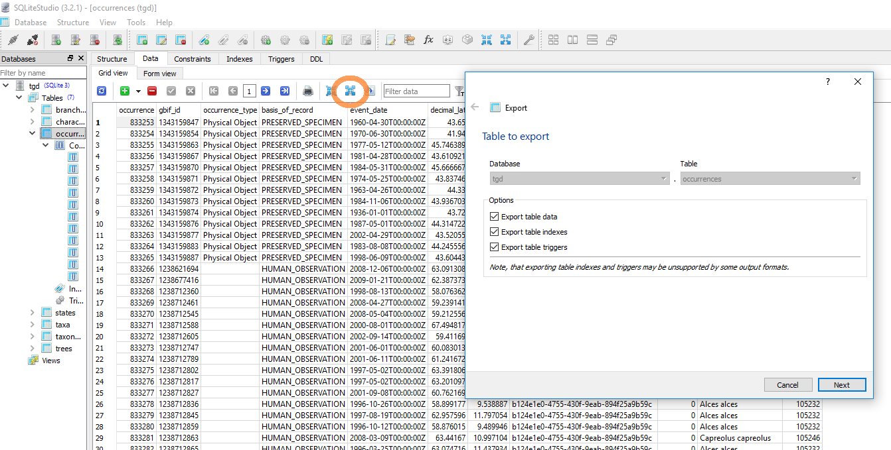

- All files in this folder were created based on a relational database .db file containing all GBIF occurrences for all ungulate species.
- To reproduce the creation of these files, the .db file can be downloaded from the following link: https://www.dropbox.com/s/rlucc0flms7gbkc/tgd.db?dl=0
- To open this file it is recommended to use [SQLiteStudio](https://sqlitestudio.pl/index.rvt). Once installed, the database can be opened using the Database -> add a database option.
- To export a csv file with occurrences for all species, open the occurrences table and set the tab in the view screen to data (see image below) and click the export table option.
- Name the file "occurrences_all_species.csv" and make sure to export it to the correct folders in your local github clone ("../trait-geo-diverse/data_extended/data/SQL_raw_gbif").

-To go from this csv file to the separate raw occurrence files in this folder and the filtered occurrences, see the [Filter GBIF records](https://github.com/naturalis/trait-geo-diverse-dl/blob/master/data_extended/script/1.Filter_GBIF_records_from_SQL_database.ipynb) script.

